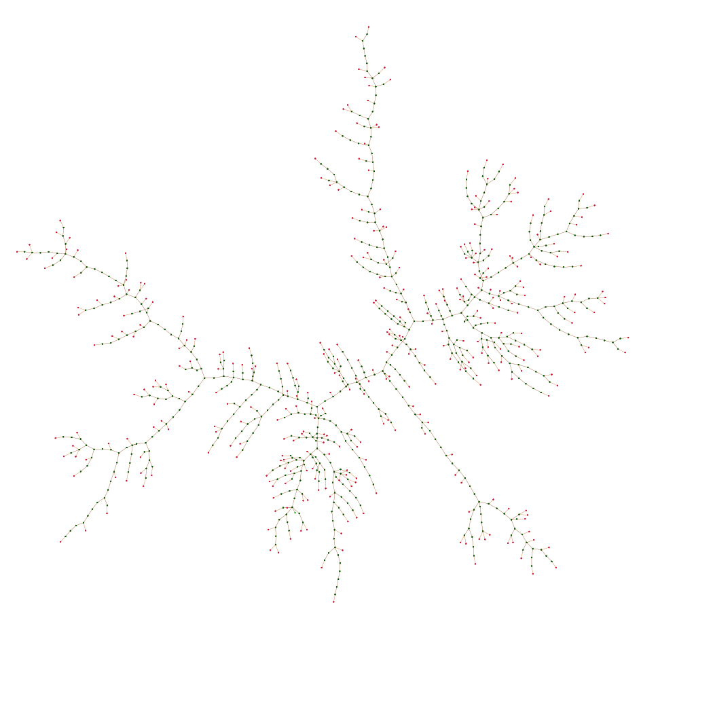

# Labelled trees

This project represents labelled trees and their relation to Cayley's formula. It is meant to illustrate the results of [Louigi Addario-Berry](http://problab.ca/louigi/) and [Serte Donderwinkel](https://www.sertedonderwinkel.com/) on [Cayley's formula via line-breaking](https://problab.ca/louigi/notes/ssprob2021.pdf).

## Getting started

### Running the code

The library requirements for this code can be found in `requirements.txt`. To install them, run the following command line in the terminal:
```sh
pip install -r requirements.txt
```
Once this is done or if the required libraries are already installed, run the following:
```sh
python main.py
```

### Organization of the code

`model.py` contains the class `LabelledTree` which is the fundamental class of this project. It creates an instance of a labelled tree based on the line-breaking construction.

`plots.py` contains the class `LabelledTreePlots` which extends the previous `LabelledTree` class. This class contains a lot of powerful functions used to represent labelled trees. Its main function is `graph()` which plots the current representation of the tree and the bijection.

`animate.py` containts the class `LabelledTreeAnimation` which extends the previous `LabelledTreePlots` class. This class contains all the function used to create the video illustrating the proof of the bijection. The function `video()` wraps all these functions together to create the video, but the main function of this class is `make_frames()`, which creates the frames of the video.

`main.py` wraps evverything together and is used to run the algorithms.

`config.py` is an extra file containing all the configuration parameters of this model. It is not necessary to understand the role of all these parameters, however, it could be interesting to change the colours according to personal tastes. For possible colour choices check the [matplotlib documentation](https://matplotlib.org/stable/gallery/color/named_colors.html).

## Results

This code mainly produces two types of results: representation of labelled trees, with their corresponding line-breaking bijection, and video illustrating the relation between these two objects.

### Labelled tree representation

The first result, obtained when running `LabelledTreePlot.tree()`, is a representation of the corresponding labelled tree. It is possible to plot or not the tree and the bijection, as well as the node numbers. With the current parameters, the results look like the following.

<p align="center"></p>.

### Labelled tree animation

The second result, obtained when running `LabelledTreeAnimation.video()`, is an illustration of the line-breaking bijection. The videos start with the method to transform the tree into a sequence of numbers, and then shows the inverse method, from a sequence of numbers to the tree. Typical results look like the following.

<p align="center"></p>.

### Large random trees.

The code developped in this project can also be useful in understanding properties of random uniform labelled trees. Indeed, the `LabelledTree` class starts by generating a uniformly sampled sequence and transforms it into its corresponding tree. Since the method used here is a bijection, this implies that the resulting trees are uniformly sampled as well. By using the `LabelledTreePlot` class, it is possible to obtain results as the following one, showing the structure of large randomly generated labelled trees.

<p align="center"></p>.

## Contact and information

If you have any questions regarding the code, feel free to contact me at <benoitcorsini@gmail.com>.